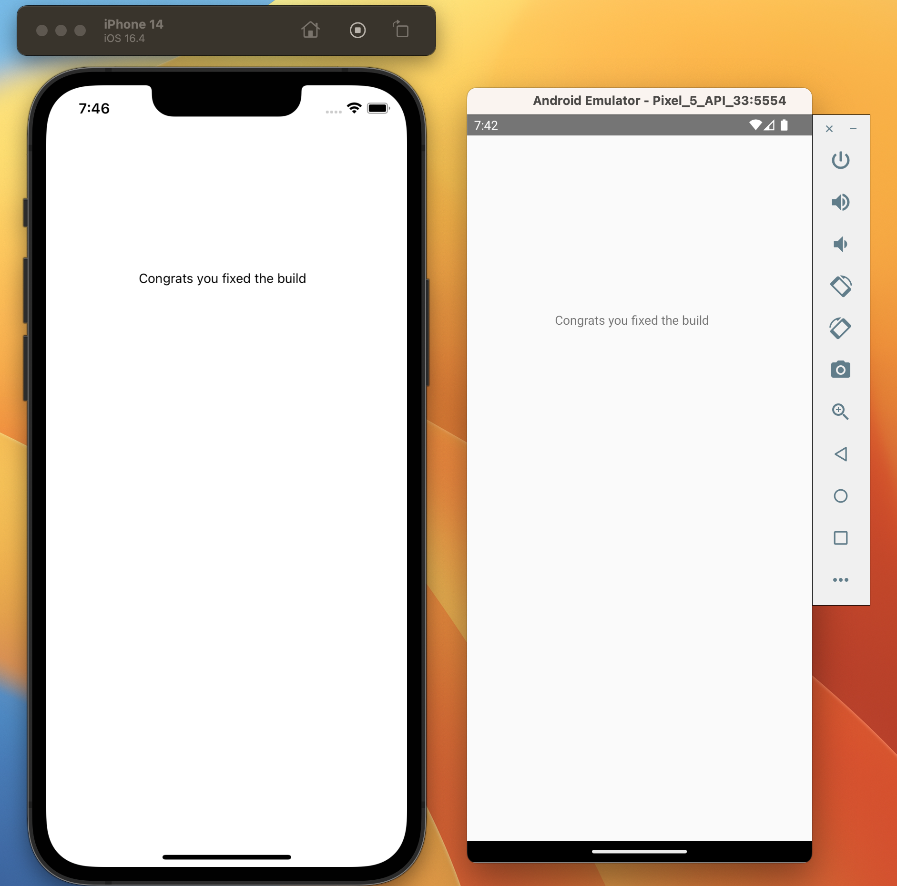

## React Native Challenge

In each of these folders is a react-native template project. 

Your task is to fix the build issues or package installation issues in each. Keep in mind there are issues for both iOS and Android builds in each project.

Keep in mind you will need to use node version 16 for the project to compile. Your end result for each of these builds should result in your iOS and Android simulators outputting the following screens:

